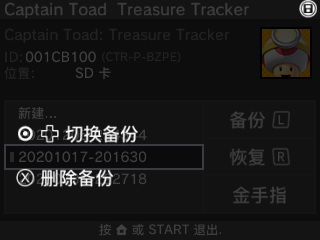

   <h2>备份存档（Checkpoint）</h2>

这是一款**汉化的自制软件**，可能需要**字库**。
### 备份
----
用十字键上下移动，用A选择软件，然后选择“**新建…”或按下L**来备份存档

当软件被选中时，“新建…”会有**蓝色边框**。
### 恢复
----
选择想要恢复的存档，选择后按下“是”来恢复。
### 金手指
----
选择游戏后，点按“金手指”，会联网匹配适应的软件的金手指（英文）。
确定保存金手指文件后，在**游戏中打开Rosalina菜单**，然后选择 **Cheat…** 来使用金手指。
> 打开Rosalina的方法是**L+下+Select**
_如果你分不清Select和Start，你是傻逼。_

### 游戏币修改
----
按住Select，会出现这样的菜单。 

看到下屏右上角的游戏币图标了吗？点击它，输入一个数字，回到桌面你就会发现你的游戏币增加了。
