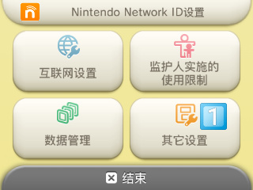
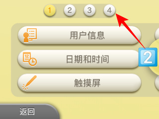
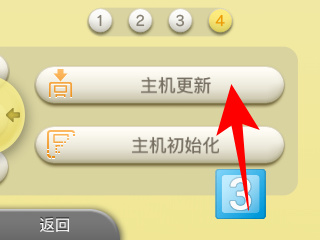

## 主机更新
更新主机的顺序是： 

**B9S-Luma3DS-主机的系统**

如果顺序不对，会出现奇奇怪怪的问题。

让我们开始吧！
----
### 更新B9S（一般不需要）
这里放出火狐站的链接，有详细的介绍内容。
#### 当你的luma是7.1
_你需要开机时按住select来查看luma的版本。_
[B9S1.0升级1.3教程](https://stray-soul.site/index.php/1-0to1-3)
#### 当你的luma小于7.0.5
[A9转B9](https://stray-soul.site/index.php/a9tob9)
#### 当你甚至没有luma
[主题破解转B9](https://stray-soul.site/index.php/menuhaxtob9)
[414转B9](https://stray-soul.site/index.php/414tob9)
### 更新Luma
火狐写有教程。
[更新Luma](https://stray-soul.site/index.php/updateluma10-2)
_你如果看不懂，请自戳双眼_
### 更新主机
1. 打开主机设置（System Settings/本体の設定）
2. 选择其他设置（Other Settings/その他の設定）

3. 滑至最后一页

4. 选择主机更新（System Update/本体の更新）

5. 两次点击右侧选项
6. 等待…
### 等待过久时
[给3DS用加速器](pages/3dsspeedup)
